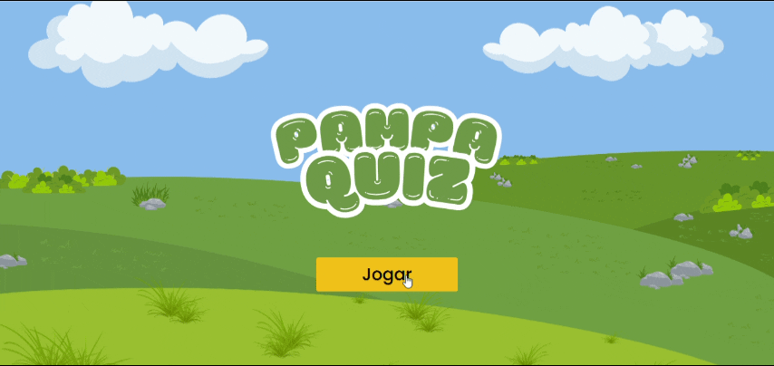

# 

> Este é um jogo desenvolvido como Trabalho de Conclusão de Curso (TCC) para o Curso Superior de Tecnologia em Análise e Desenvolvimento de Sistemas do Instituto Federal Farroupilha, Campus Alegrete.



## 🗂️ Sobre o projeto

O Pampa Quiz é um jogo web de perguntas e respostas que aborda a temática do bioma Pampa, ecossistema típico do Estado do Rio Grande do Sul.

## ⚙️ Features

- Cadastro e autenticação do usuário
- Desbloqueio de recompensas
- Feedback imediato

## 🔨 Tecnologias utilizadas

- React.js
- TypeScript
- Tailwind CSS
- JSON Server
- Axios
- React Router DOM
- HTML2Canvas
- Google Firebase
- Firestore

## 🛠️ Instalação e uso

Para rodar o projeto localmente, siga as seguintes etapas:

- Certifique-se de ter o **Node.js** instalado. [Clique aqui para instalar](https://nodejs.org/).

1. Clone o repositório na sua máquina:
    ```bash
    git clone https://github.com/marianakemmerich/tcc-pampa-quiz.git
    ```

2. Acesse a pasta do projeto:
    ```
    cd tcc-pampa-quiz
    ```

3. Instale as dependências:
    ```
    npm install
    ```

4. Inicie o servidor JSON Server:
    ```
    npx json-server --watch src/data/db.json --port 5000
    ```

5. Inicie a aplicação React:
    ```
    npm start
    ```

6. Acesse a aplicação no navegador:
    ```
    http://localhost:3000
    ```